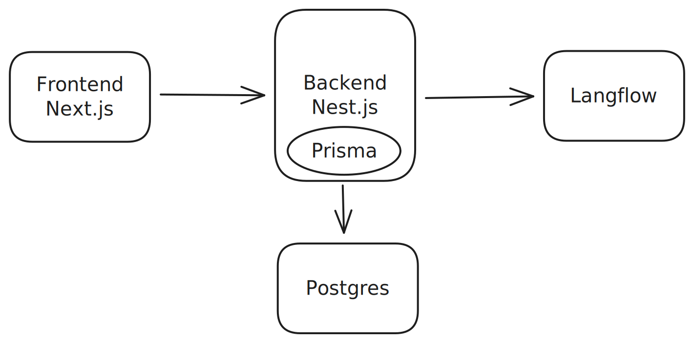

## Overall Architecture

The overall architecture of the SIEVE project is depicted in the following diagram:

Langflow handles LLM calls and all AI related tasks.
The backend is responsible for handling all database interactions and orchestrating the LLM calls.
The frontend is only directly talking to the backend and not to Langflow.

## Database Schema

The following illustration shows a detailed ER diagram of the database schema used in the SIEVE project.

The diagram includes the following entities:

- `User`: Represents the users of the system.
- `Email`: Represents the emails processed by the system.
- `Job`: Represents the jobs created for processing emails.
- `JobResult`: Represents the results of the email processing jobs.

## Frontend

The frontend is a Next.js TypeScript application. It uses the following technologies:

- Next.js, React
- TailwindCSS
- React Query
- BetterAuth
- ShadCN UI
