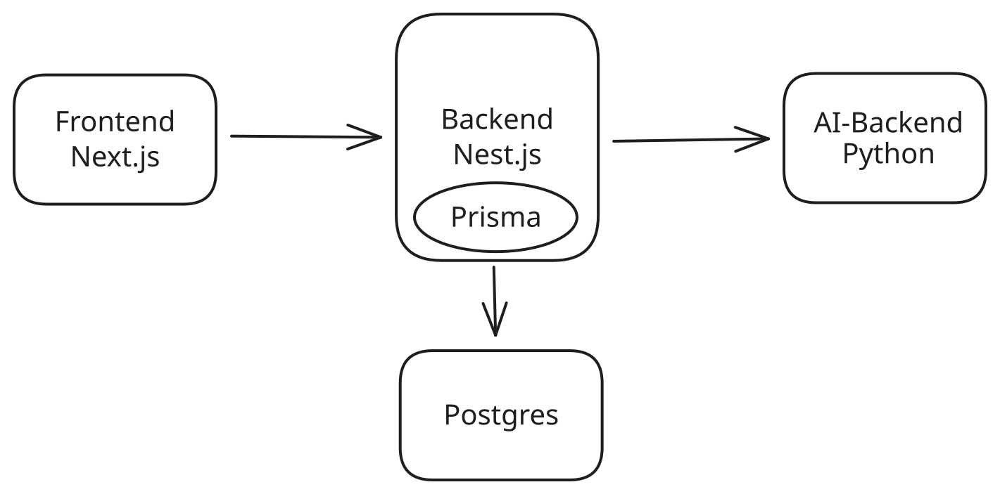
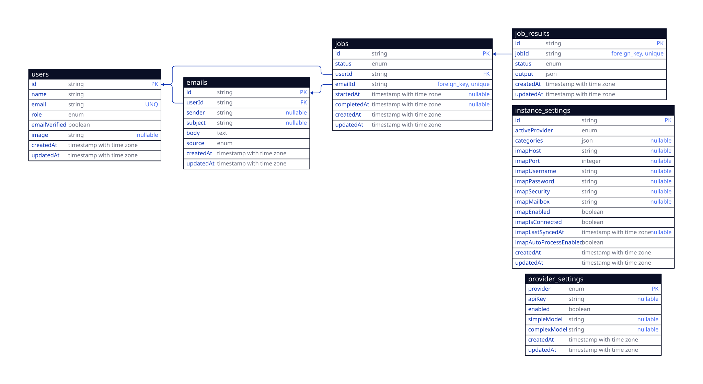

## Overall Architecture

The overall architecture of the SIEVE project is depicted in the following diagram:

The AI-Backend handles LLM calls and all AI related tasks.
The backend is responsible for handling all database interactions and orchestrating the LLM calls.
The frontend is only directly talking to the backend and not to the AI-Backend.

## Database Schema

The following illustration shows a detailed ER diagram of the database schema used in the SIEVE project.

The diagram includes the following entities:

- `User`: Represents the users of the system.
- `Email`: Represents the emails processed by the system.
- `Job`: Represents the jobs created for processing emails.
- `JobResult`: Represents the results of the email processing jobs.

## Frontend

The frontend is a Next.js TypeScript application. It uses the following technologies:

- Next.js, React
- TailwindCSS
- React Query
- BetterAuth
- ShadCN UI

## AI-Backend

The AI-Backend is a Python API application. It uses the following technologies:

- FastAPI for the http server
- Langchain/Langgraph for the LLM calls and agent orchestration
- Pydantic for data validation

### LangGraph Graphs/Workflows

The AI-Backend Email Analysis works by running the Top Level Graph beginning at the start.

#### Top Level Graph

First the email is categorized. For each category the email fits in, the corresponding flow (simple or product) is run. See other graphs below.
Then an overall email response is generated that contains the email response parts generated inside the individual flows.

#### Simple Flow Graph

This flow generates:

- an email response part to the customer, if the model decides to do so
- a structured response defined using json schema
- a human readable summary

#### Product Flow Graph

First related products to the customers request are fetched from the database (db_step), then the nodes are similar to the simple flow.
